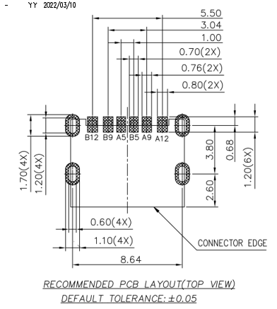
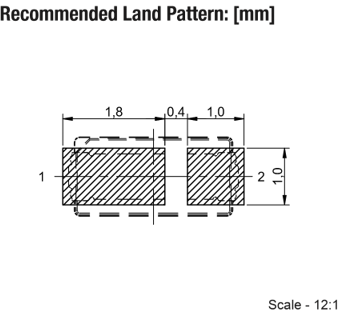
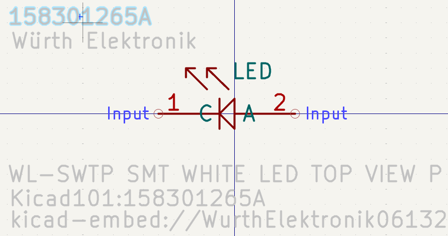
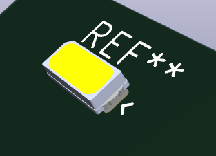
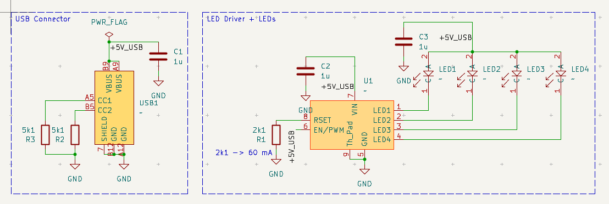
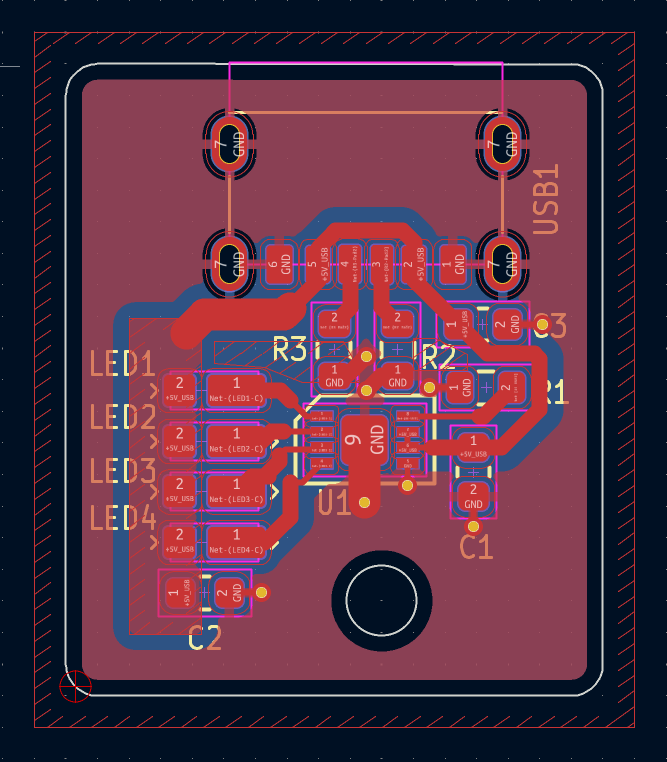

# KiCad-learning

Working through KiCad from scratch — datasheet reading, custom symbols, custom footprints, and full board layouts, from schematic capture through fabrication files. Following [Steppe School's KiCad tutorial playlist](https://www.youtube.com/playlist?list=PLmXXQ1iFwiyK4I1KeTiDFBSFvOB2ja55Y).

This repo is a public log of my progress: every component library, footprint, and board I build while learning, along with notes on what each step actually taught me.

---

## Goals

- Get fluent enough in KiCad to design and route a real board end to end
- Build the habit of reading datasheets properly instead of trusting stock libraries
- Maintain my own symbol and footprint libraries I can reuse on future projects
- Document the process well enough that it doubles as portfolio work

---

## Repo Structure

```
kicad-learning/
├── libraries/
│   ├── symbols/           # Custom .kicad_sym files
│   └── footprints/        # Custom .pretty footprint libraries
├── projects/
│   └── led-driver/        # Full board: schematic, PCB, fabrication files
│       └── fabrication/   # Gerbers + BOM submitted to PCBWay
├── datasheets/            # Reference datasheets for parts used
└── images/                # Screenshots used in this README
```

---

## Work Log

### Videos 1–4 — Datasheet, Symbol, Footprint, LED Driver

**Part:** `CAT4104VP2` — `GT3` (LED driver)

**Datasheet review.** Pulled the pin assignments, absolute maximum ratings, and the recommended land pattern out of the datasheet.


**Footprint parameters:**

- Pad count:   `8`
- Row count:   `2`
- Pad pitch:   `0.50 mm`
- Pad width:   `0.30 mm`
- Pad length:  `0.68 mm`
- Row spacing: `2.72 mm`

Row spacing isn't given directly — it's the center-to-center distance between opposite pads, so I derived it from the overall land pattern width minus one pad length.

**Symbol.** Built the schematic symbol in the Symbol Editor with pin numbers, pin names, and electrical types set to match the datasheet.


*Schematic symbol for `CAT4104VP2`.*

**Footprint.** Built the matching footprint in the Footprint Editor using the recommended land pattern — pads, silkscreen outline, courtyard, and pin 1 marker.


*Footprint for `CAT4104VP2` (`GT3`).*


*3D preview with the model assigned.*

---

### Videos 5–6 — LEDs & USB Connector

**Part:** `10164359-00011LF` (USB connector)

This component acts as the board's power source.

**Datasheet review.**



Similar approach to the LED driver for the square pads, but the oval pads are different — they're plated through-holes, used for parts that need a mechanical anchor through the board. In this case, the USB plug is secured to the board through those four holes.

**Symbol for USB connector `10164359-00011LF`**


**Footprint.**


**3D preview**


**Part:** `158301265A` (LED)

**Datasheet review.**



Same approach as before for the square pads.

**Symbol for LED `158301265A`**



**Footprint.**


**3D preview**



---

### Video 7 — Schematic Capture & ERC



This schematic connects all the components to achieve a single goal: the LED driver keeps the LEDs lit, and both the driver and the LEDs are powered by the USB connector section. The `+5V_USB` tags are net labels — any tags sharing the same name are treated as electrically connected, removing the need for wires spanning across the schematic or between sections.

After finishing the design, the Electrical Rules Checker (ERC) was used to validate the schematic. Most issues found in this simple project were solved with minor adjustments in the Symbol Editor.

**What I learned:**

- Datasheets give you much more than pins: absolute maximum ratings, operating conditions, mechanical drawings, recommended land patterns, and thermal data all shape the design.
- Rolling your own symbols beats downloading them. Online libraries often break convention or contain errors you won't catch until fab.

---

### Video 8 and 9 — PCB Stackup, Routing & Filled Zones



*Top-level board footprint.*

Before routing, set up the board's physical stackup in Board Setup — layer count, dielectric and copper layer thicknesses, and copper weight — so trace-width/impedance calculations and DRC behave correctly downstream. With the stackup defined, routed the traces, set trace widths, and added filled copper zones (ground/power pours) with proper net assignment, following best-practice pour clearance and stitching.

---

### Video 10 — ERC Cleanup

Ran the ERC again and traced each error and warning back to its source — sometimes in the top-level schematic, sometimes in an individual component's schematic symbol or footprint. Kept checking and fixing until everything cleared, then cleaned up the silkscreen.

---

### Video 11 and 12 — Gerbers, BOM & PCBWay Submission

To send the design out for fabrication with PCBWay, I needed the Gerber files and a bill of materials (BOM). Gerbers were straightforward to export from the PCB editor. The BOM took more work — I had to reformat it in the Schematic Editor to match [PCBWay's expected format](https://www.pcbway.com/blog/PCB_Assembly/How_to_Build_a_BOM__Bill_Of_Materials_.html). Downloaded both into a manufacturing folder and uploaded them to PCBWay for review.

---

## Using These Libraries

To use the custom libraries in your own KiCad project:

1. **Preferences → Manage Symbol Libraries → Add** and point to `libraries/symbols/`
2. **Preferences → Manage Footprint Libraries → Add** and point to `libraries/footprints/`

---

## Tools

- **KiCad** `9.0`
- OS: `Windows 11`

---

## References

- Steppe School KiCad tutorial playlist — https://www.youtube.com/playlist?list=PLmXXQ1iFwiyK4I1KeTiDFBSFvOB2ja55Y
- KiCad official documentation — https://docs.kicad.org
