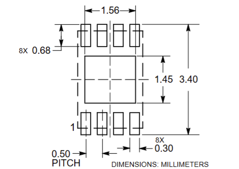
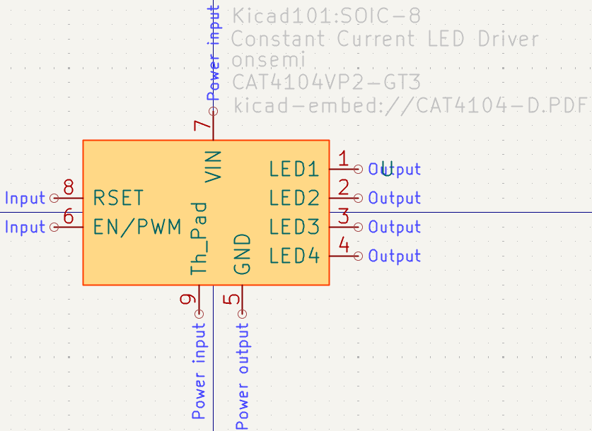
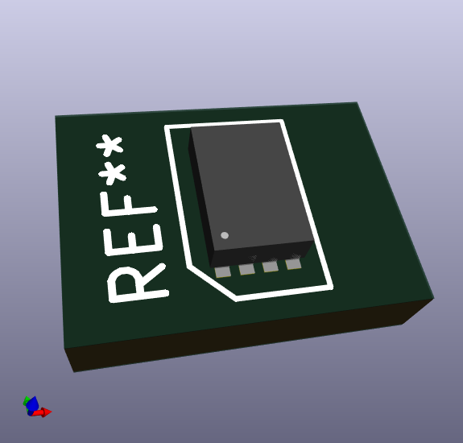
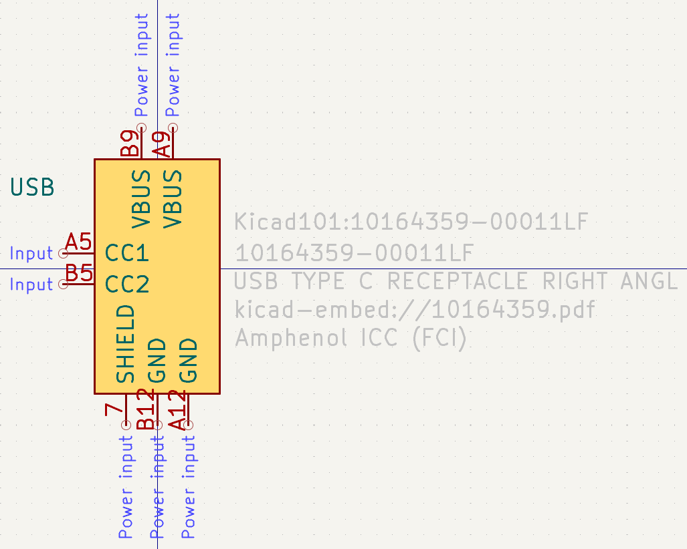
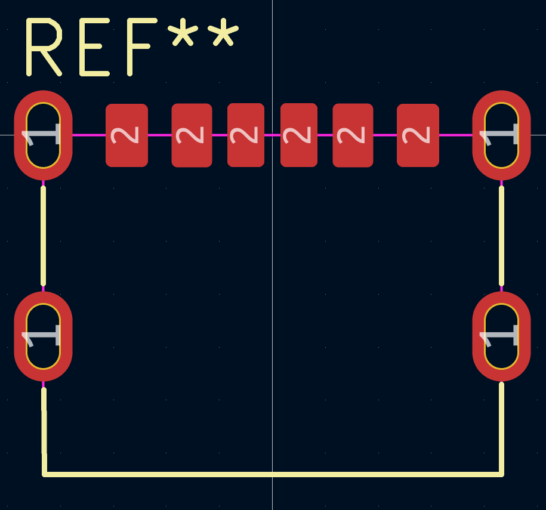
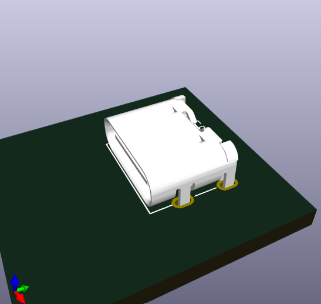

# kicad-learning

Working through KiCad from scratch — datasheet reading, custom symbols, custom footprints, and eventually full board layouts. Following [Steppe School's KiCad tutorial playlist](https://www.youtube.com/@SteppeSchool).

This repo is a public log of my progress: every component library, footprint, and board I build while learning, along with notes on what each step actually taught me.

---

## Goals

- Get fluent enough in KiCad to design and route a real board end to end
- Build the habit of reading datasheets properly instead of trusting stock libraries
- Maintain my own symbol and footprint libraries I can reuse on future projects
- Document the process well enough that it doubles as portfolio work

---

## Repo Structure

```
kicad-learning/
├── libraries/
│   ├── symbols/           # Custom .kicad_sym files
│   └── footprints/        # Custom .pretty footprint libraries
├── projects/              # Full KiCad projects (schematic + PCB) Not completed
├── datasheets/            # Reference datasheets for parts used
└── images/                # Screenshots used in this README
```

---

## Progress

| # | Topic | Status |
|---|-------|--------|
| 1 | Reading a datasheet | ✅ Done |
| 2 | Creating a schematic symbol | ✅ Done |
| 3 | Creating a footprint | ✅ Done |
| 4 | Schematic capture | ⬜ Not started |
| 5 | PCB layout & routing | ⬜ Not started |

---

## Work Log

### Videos 1–4 — Datasheet, Symbol, Footprint, LED Driver

**Part:** `CAT4104VP2` — `GT3`

**Datasheet review.** Pulled the pin assignments, absolute maximum ratings,
and the recommended land pattern out of the datasheet.



**Footprint parameters:**

- Pad count:   `8`
- Row count:   `2`
- Pad pitch:   `0.50 mm`
- Pad width:   `0.30 mm`
- Pad length:  `0.68 mm`
- Row spacing: `2.72 mm`

Row spacing isn't given directly — it's the center-to-center distance between
opposite pads, so I derived it from the overall land pattern width minus one
pad length.

**Symbol.** Built the schematic symbol in the Symbol Editor with pin numbers, pin names, and electrical types set to match the datasheet.



*Schematic symbol for `[CAT4104VP2]`.*

**Footprint.** Built the matching footprint in the Footprint Editor using the recommended land pattern — pads, silkscreen outline, courtyard, and pin 1 marker.


*Footprint for `CAT4104VP2` (`GT3`).*



*3D preview with the model assigned.*

---

### Videos 5-7 — LEDs, USB connector, Schematic

### USB

**Datasheet review.**


Simmilar method for the square pads but the oval components pads are special. They are through out holes, used for things that would go through the whole PCB board. In this case, the USB plug is attaged to the board at those 4 holes  

**Symbol for USB connector `[10164359-00011LF]`**



**Footprint.**



**3D preview**




---

### LEDs


---


**What I learned:**

- Datasheets give you much more than pins: absolute maximum ratings,
  operating conditions, mechanical drawings, recommended land patterns, and
  thermal data all shape the design.
- Rolling your own symbols beats downloading them. Online libraries often
  break convention or contain errors you won't catch until fab.

---

## Using These Libraries

To use the custom libraries in your own KiCad project:

1. **Preferences → Manage Symbol Libraries → Add** and point to `libraries/symbols/`
2. **Preferences → Manage Footprint Libraries → Add** and point to `libraries/footprints/`

---

## Tools

- **KiCad** `9.0`
- OS: `Windows 11`

---

## References

- Steppe School KiCad tutorial playlist — https://www.youtube.com/playlist?list=PLmXXQ1iFwiyK4I1KeTiDFBSFvOB2ja55Y
- KiCad official documentation — https://docs.kicad.org